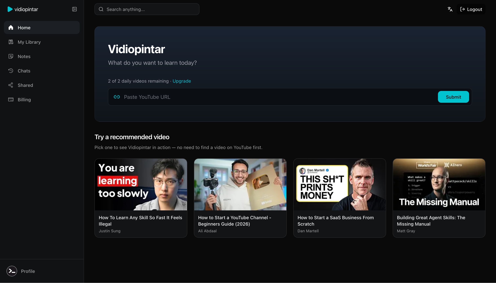
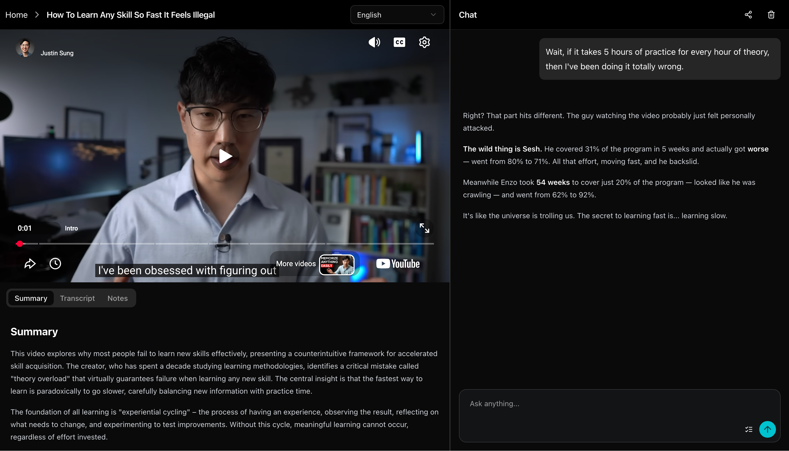

# Vidiopintar.com

Plataforma de aprendizaje de videos de YouTube impulsada por IA. Envía un enlace de YouTube para obtener resúmenes de videos y chatear con el contenido utilizando IA.





## Stack Tecnológico

- **Frontend**: Next.js 14, React 18, TypeScript, Tailwind CSS
- **Base de datos**: SQLite con Drizzle ORM (`better-sqlite3`)
- **Autenticación**: Better Auth
- **IA**: OpenAI y Google AI SDK

## Inicio Rápido

```bash
# Instalar dependencias
npm install

# Configurar base de datos
mkdir -p data
npm run db:migrate

# Iniciar servidor de desarrollo
npm run dev
```

## Variables de Entorno

Copia `.env.example` a `.env` y configura:
- `SQLITE_DATABASE_PATH` (predeterminado: `./data/vidiopintar.db`)
- Clave API de OpenAI
- Clave API de Google AI
- Secretos de autenticación

## Configuración de Desarrollo con Docker

### Opción 1: Construir y Ejecutar Localmente

```bash
# Construir la imagen de Docker
docker build -t vidiopintar-app .

# Ejecutar el contenedor (asegúrate de tener el archivo .env en la raíz del proyecto)
docker run -d --name vidiopintar-dev -p 5000:3000 \
  -v "$(pwd)/data:/data" \
  --env-file .env \
  vidiopintar-app
```

### Opción 2: Usar Imagen Preconstruida

```bash
# Descargar la última imagen
docker pull ghcr.io/ahmadrosid/vidiopintar.com:latest

# Ejecutar el contenedor
docker run -d --name vidiopintar-app -p 5000:3000 --env-file .env ghcr.io/ahmadrosid/vidiopintar.com:latest

# Eliminar contenedor de Docker
docker stop vidiopintar-app && docker rm vidiopintar-app
```

### Notas sobre el Entorno de Docker

- La aplicación se ejecuta en el puerto 3000 dentro del contenedor
- Montar almacenamiento persistente en `/data` (ej. `-v "$(pwd)/data:/data"`)
- `SQLITE_DATABASE_PATH` tiene como predeterminado `/data/vidiopintar.db` en producción; si tu `.env` establece `./data/vidiopintar.db` para desarrollo local, tanto la aplicación como Drizzle usarán `/data` dentro del contenedor
- El contenedor ejecuta `drizzle-kit migrate` automáticamente al iniciar
- Asegúrate de que tu archivo `.env` contenga todas las variables requeridas de `.env.example`
- Accede a la aplicación en `http://localhost:5000`

### Detener el Contenedor

```bash
# Detener y eliminar el contenedor
docker stop vidiopintar-dev
docker rm vidiopintar-dev
```

## Herramienta CLI de Chat para YouTube

Una sencilla herramienta de línea de comandos para chatear con transcripciones de videos de YouTube. Consulta [`youtube-cli/README.md`](youtube-cli/README.md) para documentación detallada.

### Inicio Rápido

```bash
# Establecer tu clave API de DeepSeek
export DEEPSEEK_API_KEY=your-api-key-here

# Ejecutar la CLI
bun run youtube-chat <youtube-url>
```

Para más detalles, consulta la [documentación de youtube-cli](youtube-cli/README.md).
