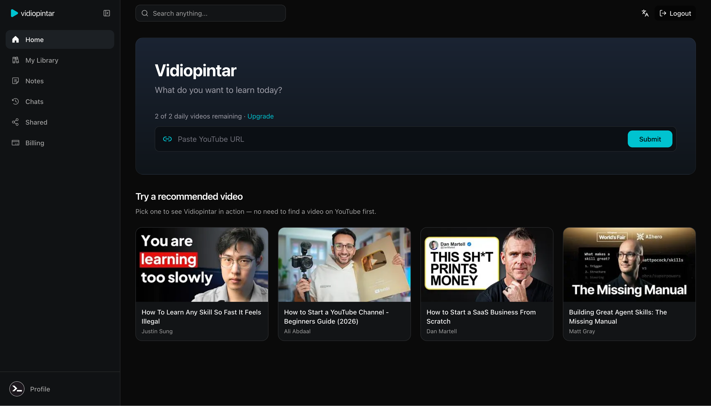
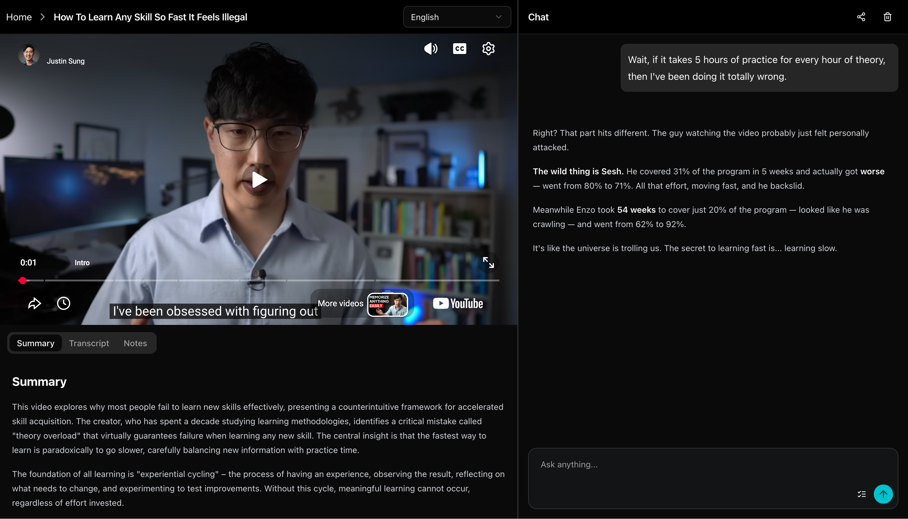

# Vidiopintar.com

AI-powered YouTube video learning platform. Submit a YouTube link to get video summaries and chat with the content using AI.





## Tech Stack

- **Frontend**: Next.js 14, React 18, TypeScript, Tailwind CSS
- **Database**: SQLite with Drizzle ORM (`better-sqlite3`)
- **Auth**: Better Auth
- **AI**: OpenAI & Google AI SDK

## Quick Start

```bash
# Install dependencies
npm install

# Setup database
mkdir -p data
npm run db:migrate

# Start development server
npm run dev
```

## Environment Variables

Copy `.env.example` to `.env` and configure:
- `SQLITE_DATABASE_PATH` (default: `./data/vidiopintar.db`)
- OpenAI API key
- Google AI API key
- Auth secrets

## Docker Development Setup

### Option 1: Build and Run Locally

```bash
# Build the Docker image
docker build -t vidiopintar-app .

# Run the container (make sure to have .env file in the project root)
docker run -d --name vidiopintar-dev -p 5000:3000 \
  -v "$(pwd)/data:/data" \
  --env-file .env \
  vidiopintar-app
```

### Option 2: Using Pre-built Image

```bash
# Pull the latest image
docker pull ghcr.io/ahmadrosid/vidiopintar.com:latest

# Run the container
docker run -d --name vidiopintar-app -p 5000:3000 --env-file .env ghcr.io/ahmadrosid/vidiopintar.com:latest

# Remove docker container
docker stop vidiopintar-app && docker rm vidiopintar-app
```

### Docker Environment Notes

- The app runs on port 3000 inside the container
- Mount persistent storage at `/data` (e.g. `-v "$(pwd)/data:/data"`)
- `SQLITE_DATABASE_PATH` defaults to `/data/vidiopintar.db` in production; if your `.env` sets `./data/vidiopintar.db` for local dev, both the app and Drizzle use `/data` inside the container
- The container runs `drizzle-kit migrate` automatically on startup
- Make sure your `.env` file contains all required variables from `.env.example`
- Access the app at `http://localhost:5000`

### Stopping the Container

```bash
# Stop and remove the container
docker stop vidiopintar-dev
docker rm vidiopintar-dev
```

## YouTube CLI Chat Tool

A simple command-line tool to chat with YouTube video transcripts. See [`youtube-cli/README.md`](youtube-cli/README.md) for detailed documentation.

### Quick Start

```bash
# Set your DeepSeek API key
export DEEPSEEK_API_KEY=your-api-key-here

# Run the CLI
bun run youtube-chat <youtube-url>
```

For more details, see the [youtube-cli documentation](youtube-cli/README.md).
