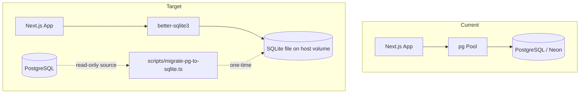
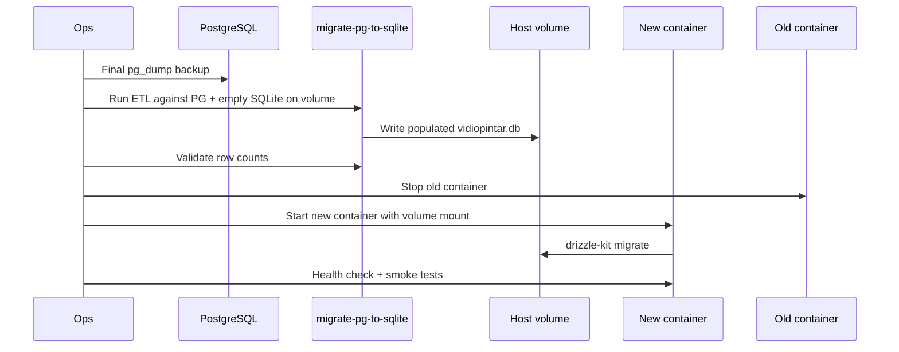

# refactor: Switch database from PostgreSQL to SQLite

## Summary

Replace the external PostgreSQL dependency with a file-backed SQLite database using Drizzle ORM and `better-sqlite3`, port Postgres-specific schemas and raw SQL, migrate production data once, and update deployment/backup tooling so the SQLite file survives blue-green deploys on the VPS.

## Problem Frame

Vidiopintar runs on Next.js 15 with Drizzle ORM over a `pg` connection pool to an external PostgreSQL instance (Neon in production, local Postgres in development). That adds operational overhead — separate database hosting, `pg_dump`/`pg_restore` backup scripts, SSL connection config, and five discrete `DB_*` env vars — for a single-server VPS deployment that does not need Postgres-specific features at scale.

The codebase has 15 PostgreSQL migration files, seven Drizzle schema modules using `pg-core`, Better Auth configured with `provider: "pg"`, and three admin query modules with heavy Postgres-specific raw SQL (`INTERVAL`, `DATE_TRUNC`, `TO_CHAR`, JSON `->>` operators). A dialect switch is not a dependency bump; it touches connection setup, every schema definition, migration history, analytics SQL, ops scripts, and the production cutover path.

## Requirements

**Database runtime**

- R1. The application reads and writes exclusively through SQLite in all environments after cutover.
- R2. The SQLite database file path is configured via a single env var (`SQLITE_DATABASE_PATH`), replacing `DB_USER`, `DB_PASSWORD`, `DB_HOST`, `DB_PORT`, and `DB_NAME`.
- R3. The connection enables WAL mode and a busy timeout so concurrent reads during deploys do not fail immediately on lock contention.

**Schema and ORM**

- R4. All Drizzle schema modules use `sqlite-core` table builders with SQLite-compatible column types.
- R5. Drizzle Kit generates and applies a fresh SQLite migration baseline; the 15 existing PostgreSQL migration files are retired, not converted.
- R6. Better Auth uses the Drizzle adapter with `provider: "sqlite"` and continues to serve login, session, and OAuth flows without schema regressions.

**Query portability**

- R7. All raw SQL in admin analytics modules executes correctly on SQLite with equivalent semantics to the current Postgres queries.
- R8. Postgres-specific operators in repository code (JSON `->>`, `rowCount` checks) are replaced with SQLite-compatible equivalents.

**Data and operations**

- R9. Existing production PostgreSQL data is migrated into SQLite before cutover with per-table row-count validation.
- R10. The production SQLite file lives on a host-mounted volume shared by deploy containers so data persists across blue-green swaps.
- R11. Backup and restore scripts target the SQLite file instead of `pg_dump`/`pg_restore`.
- R12. Deployment runs migrations against the mounted database file before or during container startup.

**Verification**

- R13. Health check, auth, core user flows (video add, chat message, share), and admin dashboards work against SQLite in staging before production cutover.

---

## Assumptions

These follow from the confirmed scope where call-out sides were not explicitly chosen:

- **Data migration:** Production data is preserved (not a fresh empty database).
- **Storage:** SQLite file on a host volume at a fixed path (e.g. `/var/lib/vidiopintar/vidiopintar.db`).
- **Migration history:** Clean SQLite baseline regenerated from converted schemas; PG migration chain is archived, not mechanically converted.
- **Driver:** `better-sqlite3` (synchronous, Node-compatible, matches the VPS Docker/Node 20 runtime — not Turso/libSQL unless edge deployment is later required).
- **Blue-green concurrency:** During cutover, only one container writes to the SQLite file at a time; the old container stops before the new one serves traffic.

---

## Key Technical Decisions

**KTD-1: Full dialect switch, not dual-provider**

Drizzle requires separate `pg-core` and `sqlite-core` schemas; there is no unified schema. The plan converts schemas in place and removes `pg` entirely rather than maintaining parallel PG/SQLite paths. Rationale: the user requested a switch, not dual support; dual schemas double maintenance on admin SQL and migrations.

**KTD-2: `better-sqlite3` over `bun:sqlite` or libSQL**

Use `drizzle-orm/better-sqlite3` with the `better-sqlite3` native module. Rationale: Next.js standalone runs on Node 20 in Docker; `better-sqlite3` is the most documented Drizzle SQLite driver for this stack. Bun is used only for deploy scripts, not the app runtime.

**KTD-3: SQLite type mapping strategy**

| Postgres construct | SQLite replacement |
|---|---|
| `serial` | `integer().primaryKey({ autoIncrement: true })` |
| `uuid().defaultRandom()` | `text` PK with app-generated UUID on insert, or Drizzle `$defaultFn(() => crypto.randomUUID())` |
| `json` / `jsonb` | `text({ mode: 'json' })` |
| `decimal(p, s)` | `text` (preserve precision for costs) |
| `timestamp({ withTimezone: true })` | `integer` (unix ms via `mode: 'timestamp_ms'`) — matches Drizzle SQLite timestamp mode |
| `time` (transcript segments) | `text` storing `HH:MM:SS` |
| `real` | `real` (unchanged) |

Rationale: SQLite has no native UUID, timestamptz, or TIME types; text/integer mappings are the standard Drizzle SQLite approach.

**KTD-4: Centralized row accessor for `db.execute()`**

Introduce a small helper (e.g. `src/lib/db/execute.ts`) that normalizes `db.execute()` results to a `rows` array. Rationale: `better-sqlite3` returns rows differently than `node-postgres`; admin modules currently assume `result.rows` in ~15 places.

**KTD-5: Sequential cutover instead of overlapping writers**

Modify blue-green deploy so the old container fully stops before the new container writes to the shared SQLite file. Rationale: SQLite allows one writer; overlapping containers during health-check overlap risks `SQLITE_BUSY` errors.

**KTD-6: One-time ETL script for data migration**

Build a Bun/TS script that reads from PostgreSQL (using `pg` as a devDependency for migration only) and writes to SQLite table-by-table in FK order. Rationale: `pg_restore` output is not SQLite-compatible; direct row copy preserves IDs and relationships.

---

## High-Level Technical Design

### Component topology

### Cutover sequence

### Date/time SQL translation reference

Admin queries use Postgres date functions extensively. The port follows these replacements:

| Postgres | SQLite |
|---|---|
| `NOW()` | `datetime('now')` |
| `NOW() - INTERVAL 'N days'` | `datetime('now', '-N days')` |
| `DATE_TRUNC('month', ts)` | `date(ts, 'start of month')` |
| `DATE_TRUNC('week', ts)` | `date(ts, 'weekday 0', '-6 days')` |
| `TO_CHAR(ts, 'YYYY-MM-DD')` | `strftime('%Y-%m-%d', ts)` |
| `DATE(ts)` | `date(ts)` |
| `metadata->>'key'` | `json_extract(metadata, '$.key')` |

---

## Scope Boundaries

**In scope**

- Schema conversion, connection layer, Drizzle config, fresh migrations
- Better Auth adapter change
- Admin/cost/users query SQL porting
- `repository.ts` JSON operator and delete result handling
- `scripts/remove-duplicates.ts` port
- Env, Dockerfile, deploy script, backup scripts, README
- One-time PG→SQLite data migration script
- Minimal smoke verification script (no full test suite)

**Out of scope**

- Schema redesign or normalization beyond SQLite type requirements
- Turso/libSQL/edge SQLite providers
- Dual PostgreSQL + SQLite runtime support
- Performance optimization or read-replica architecture
- Automated integration test suite (repo has zero tests today)

### Deferred to Follow-Up Work

- Add proper integration tests for admin analytics SQL
- Evaluate `node:sqlite` (Node 22+) to drop native `better-sqlite3` build deps
- Archive Postgres deployment artifacts (`deployment/start-postgres-local.sh`, `deployment/pg_hba.conf`) to `docs/legacy/` instead of deleting

---

## System-Wide Impact

| Stakeholder | Impact |
|---|---|
| **End users** | No visible change if migration succeeds; sessions preserved via data ETL |
| **Developers** | New env var, local `.db` file, `db:generate`/`db:migrate` against SQLite |
| **Operations** | No external Postgres to manage; file-based backup replaces `pg_dump`; deploy gains volume mount |
| **CI/CD** | Dockerfile build args change; no DB service needed in CI (migrations run against file or skipped at build) |

**Concurrency posture:** SQLite WAL supports multiple readers but one writer. The app's read-heavy profile (video browsing, chat reads) fits WAL; write bursts (message inserts, token usage logging) serialize. Monitor `SQLITE_BUSY` in logs after cutover.

---

## Risks & Dependencies

| Risk | Severity | Mitigation |
|---|---|---|
| Admin SQL semantic drift after port | High | Compare key admin metrics PG vs SQLite on staging dump before cutover |
| Blue-green dual-container write conflict | High | Stop old container before new serves traffic (KTD-5) |
| Alpine `better-sqlite3` native build failure | Medium | Add `python3 make g++` to Dockerfile deps stage |
| Data migration FK/order errors | High | ETL in topological table order; validate counts; dry-run on Neon backup |
| `result.rows` API mismatch | High | Centralized execute helper (KTD-4) |
| Auth session invalidation | Medium | Migrate `session` table completely; test login before DNS/traffic switch |
| No automated tests | Medium | Smoke script covering health, auth, CRUD, admin load |

**Dependencies:** Final `pg_dump` before cutover; VPS directory creation with correct permissions for `nextjs` user (uid 1001); brief maintenance window for sequential cutover.

---

## Implementation Units

### U1. Dependencies and environment configuration

**Goal:** Swap database packages and replace Postgres env vars with SQLite path configuration.

**Requirements:** R1, R2

**Dependencies:** None

**Files:**
- `package.json`
- `package-lock.json`
- `src/lib/env/server.ts`
- `.env.example`

**Approach:** Remove `pg`, `@types/pg`, `pg-connection-string`. Add `better-sqlite3`, `@types/better-sqlite3`. Keep `pg` as optional devDependency only for the one-time migration script (U6). Replace five `DB_*` zod fields with `SQLITE_DATABASE_PATH: z.string().min(1)`.

**Patterns to follow:** Existing `@t3-oss/env-nextjs` pattern in `src/lib/env/server.ts`.

**Test scenarios:**
- Happy path: app boots with `SQLITE_DATABASE_PATH=./data/dev.db` and env validation passes.
- Edge case: missing `SQLITE_DATABASE_PATH` throws at startup with a clear validation error.
- Error path: empty string for path is rejected (`emptyStringAsUndefined: true`).

**Verification:** `next build` succeeds with updated env schema; no remaining imports of `DB_HOST` etc. in application code.

---

### U2. Connection layer and execute helper

**Goal:** Replace `pg` Pool with `better-sqlite3` singleton and normalize raw query results.

**Requirements:** R1, R3, R8

**Dependencies:** U1

**Files:**
- `src/lib/db/index.ts` (modify)
- `src/lib/db/execute.ts` (create)

**Approach:** Create `Database` from `SQLITE_DATABASE_PATH`; run `PRAGMA journal_mode = WAL` and `PRAGMA busy_timeout = 5000` on open. Use dev global singleton pattern (mirror current `global.pg`). Export `db = drizzle(sqlite, { schema })` passing full schema. `executeQuery()` wraps `db.execute()` and returns `{ rows: ... }` regardless of driver.

**Patterns to follow:** Current singleton pattern in `src/lib/db/index.ts`; Drizzle SQLite README pragmas.

**Test scenarios:**
- Happy path: `SELECT 1` via execute helper returns one row.
- Integration: `/api/health` returns 200 when SQLite file exists and is readable.
- Edge case: SQLite file parent directory is created if missing (dev convenience only — prod path pre-created by ops).

**Verification:** Health endpoint passes locally against a fresh SQLite file.

---

### U3. Schema conversion to sqlite-core

**Goal:** Convert all seven schema modules from `pg-core` to `sqlite-core` with type mappings from KTD-3.

**Requirements:** R4

**Dependencies:** U1

**Files:**
- `src/lib/db/schema/auth.ts`
- `src/lib/db/schema/videos.ts`
- `src/lib/db/schema/messages.ts`
- `src/lib/db/schema/notes.ts`
- `src/lib/db/schema/token-usage.ts`
- `src/lib/db/schema/transactions.ts`
- `src/lib/db/schema/payment-settings.ts`
- `src/lib/db/schema/index.ts`

**Approach:** Replace `pgTable` → `sqliteTable`, import from `drizzle-orm/sqlite-core`. Apply KTD-3 mappings. Keep table and column names identical to minimize query churn. Auth table `"user"` remains a reserved name — keep quoting in raw SQL.

**Patterns to follow:** Existing schema structure and relations; Drizzle sqlite-core docs for `text({ mode: 'json' })`.

**Test scenarios:**
- Happy path: `drizzle-kit generate` succeeds with zero errors against converted schemas.
- Edge case: `transcript_segments.start`/`end` stored as text still round-trips HH:MM:SS values used by the app.
- Edge case: UUID columns accept existing PG UUID strings after data migration.

**Verification:** TypeScript compiles; no remaining `drizzle-orm/pg-core` imports in `src/lib/db/schema/`.

---

### U4. Drizzle config and fresh migration baseline

**Goal:** Retire PostgreSQL migrations and establish a single SQLite baseline.

**Requirements:** R5, R12

**Dependencies:** U3

**Files:**
- `drizzle.config.ts`
- `src/drizzle/` (replace contents)
- `src/drizzle/meta/` (regenerated)
- `package.json` (scripts unchanged)

**Approach:** Set `dialect: "sqlite"`, `dbCredentials: { url: env.SQLITE_DATABASE_PATH }`. Archive existing `src/drizzle/*.sql` and meta to `src/drizzle/archive-postgres/` (or delete after backup — prefer archive for rollback reference). Run `npm run db:generate` to produce `0000_*.sql` baseline. Document in README that `db:push` is dev-only and `db:migrate` is used for prod.

**Patterns to follow:** Existing `drizzle.config.ts` structure; `package.json` db scripts.

**Test scenarios:**
- Happy path: `db:migrate` against empty SQLite file creates all 15 tables.
- Happy path: `db:studio` opens and lists tables.
- Error path: running old PG migration SQL against SQLite fails fast (confirms PG chain is not applied).

**Verification:** Fresh SQLite file has correct table count matching former PG schema (15 tables).

---

### U5. Better Auth adapter

**Goal:** Point Better Auth at SQLite provider.

**Requirements:** R6

**Dependencies:** U2, U3

**Files:**
- `src/lib/auth.ts`

**Approach:** Change `provider: "pg"` to `provider: "sqlite"`. Keep explicit `schema` export from `src/lib/db/schema` (auth tables already defined in `auth.ts`). Verify table names match Better Auth expectations (`user`, `session`, `account`, `verification`).

**Patterns to follow:** Current `src/lib/auth.ts` adapter wiring.

**Test scenarios:**
- Happy path: Google OAuth login creates session row in SQLite.
- Happy path: email/password signup and subsequent session retrieval work.
- Edge case: existing migrated sessions remain valid (user can stay logged in post-cutover if session rows migrated).

**Verification:** Manual login flow succeeds against SQLite with seeded/migrated auth data.

---

### U6. Port raw SQL and repository Postgres-isms

**Goal:** Make all analytics and utility queries SQLite-compatible.

**Requirements:** R7, R8

**Dependencies:** U2, U4

**Files:**
- `src/lib/admin-queries.ts`
- `src/lib/users-admin-queries.ts`
- `src/lib/cost-admin-queries.ts`
- `src/lib/db/repository.ts`
- `src/lib/db/repository/token-usage.ts`
- `scripts/remove-duplicates.ts`

**Approach:** Replace Postgres date/interval functions per HTD translation table. Route all `db.execute()` calls through execute helper from U2. In `repository.ts`, change `metadata->>'messageId'` to `json_extract(metadata, '$.messageId')`; replace `result.rowCount` with SQLite-compatible check (Drizzle delete return value or `changes` from driver). Rewrite `remove-duplicates.ts` delete to SQLite subquery form (no `DELETE ... USING`); replace `array_agg` with `group_concat`.

**Execution note:** Port `users-admin-queries.ts` first — it has the highest Postgres-specific concentration (`getRetentionCohorts` CTE with `DATE_TRUNC`, `TO_CHAR`, `INTERVAL`).

**Patterns to follow:** Existing query structure; keep CTEs (SQLite 3.25+ supports window functions and CTEs used in `admin-queries.ts`).

**Test scenarios:**
- Happy path: `getAdminMetrics()` returns numeric counts on empty and populated DB.
- Happy path: `getRetentionCohorts()` returns cohort rows with percentage fields.
- Happy path: `getTopUsersByCost()` returns sorted users with cost aggregates.
- Edge case: admin dashboards with zero data render without SQL errors.
- Edge case: `FeedbackRepository.existsByUserAndMessage` matches on JSON metadata after `json_extract` change.
- Integration: admin pages at `src/app/admin/**` load without server errors.

**Verification:** All admin dashboard charts render against SQLite populated with representative data.

---

### U7. Data migration script

**Goal:** One-time ETL from PostgreSQL to SQLite preserving production data.

**Requirements:** R9

**Dependencies:** U3, U4

**Files:**
- `scripts/migrate-pg-to-sqlite.ts` (create)
- `package.json` (add `db:migrate-from-pg` script)

**Approach:** Script accepts PG connection via env (`MIGRATE_PG_*` vars or temporary `.env.db.neon`) and target `SQLITE_DATABASE_PATH`. Migrate tables in FK order: `user` → `account`, `session`, `verification` → `videos` → `user_videos` → `messages`, `notes`, `shared_videos`, `transcript_segments`, `token_usage`, `transactions`, `payment_settings`, `feedback`. After import, reset `sqlite_sequence` for autoincrement tables. Print per-table source/target row counts; exit non-zero on mismatch.

**Patterns to follow:** Table inventory from `src/drizzle/meta/0014_snapshot.json`; backup script env loading pattern from `backup/backup.sh`.

**Test scenarios:**
- Happy path: migrate Neon staging dump; all table counts match.
- Edge case: JSON columns serialize/deserialize correctly (`quick_start_questions`, `feedback.metadata`).
- Edge case: decimal cost values in `token_usage` preserve precision as text.
- Error path: script aborts if target SQLite file already has rows (unless `--force` flag).

**Verification:** Row counts match PG source; spot-check auth login, a user_video with messages, and token_usage sums.

---

### U8. Deployment, Docker, and backup tooling

**Goal:** Run SQLite in production with persistent storage and updated ops scripts.

**Requirements:** R10, R11, R12

**Dependencies:** U1, U2, U4, U7

**Files:**
- `Dockerfile`
- `deployment/deploy.ts`
- `backup/backup.sh`
- `backup/restore-to-local.sh`
- `README.md`
- `.gitignore`

**Approach:** Dockerfile: add native build deps in deps stage for `better-sqlite3`; replace PG build args with `SQLITE_DATABASE_PATH`; ensure runner can write to mounted path. `deploy.ts`: add `-v /var/lib/vidiopintar:/data` (or configured path); set `SQLITE_DATABASE_PATH=/data/vidiopintar.db` in env; stop old container before starting new (KTD-5); optionally run `drizzle-kit migrate` pre-health-check. Backup: replace `pg_dump` with `sqlite3 $DB ".backup $DEST"` or file copy after WAL checkpoint. README: update tech stack and quick start. `.gitignore`: add `*.db`, `*.db-wal`, `*.db-shm`, keep ignoring `.env`.

**Patterns to follow:** Existing `deployment/deploy.ts` blue-green flow; `backup/backup.sh` structure.

**Test scenarios:**
- Happy path: deploy script mounts volume and new container passes health check.
- Happy path: backup script produces restorable `.db` file.
- Edge case: deploy with missing volume directory fails with actionable error.
- Integration: restore backup to staging path and app reads data correctly.

**Verification:** Staging deploy survives container restart without data loss; backup/restore round-trip succeeds.

---

### U9. Smoke verification script

**Goal:** Provide repeatable pre-cutover checks without a full test framework.

**Requirements:** R13

**Dependencies:** U5, U6, U8

**Files:**
- `scripts/verify-sqlite.ts` (create)
- `package.json` (add `db:verify` script)

**Approach:** Script runs: health query, table existence check, count sanity (users > 0 in prod migration), sample admin metric query, auth schema tables present. Exit 0/1 for CI or manual gate.

**Test scenarios:**
- Happy path: all checks pass on migrated staging DB.
- Error path: missing table or zero users when expects data → exit 1.

**Verification:** Script passes on staging before production cutover is approved.

---

## Open Questions

None blocking — assumptions in the Assumptions section cover unresolved call-out sides. Revisit if production traffic exceeds single-writer SQLite comfort (unlikely at current scale).

---

## Sources & Research

- Drizzle ORM SQLite driver docs: [drizzle-orm sqlite-core README](https://github.com/drizzle-team/drizzle-orm/blob/main/drizzle-orm/src/sqlite-core/README.md)
- Drizzle multi-dialect guidance: [GitHub Discussion #5269](https://github.com/drizzle-team/drizzle-orm/discussions/5269)
- Better Auth Drizzle adapter: [better-auth.com/docs/adapters/drizzle](https://better-auth.com/docs/adapters/drizzle)
- Local patterns: `src/lib/db/index.ts`, `src/lib/users-admin-queries.ts`, `deployment/deploy.ts`, `backup/backup.sh`
